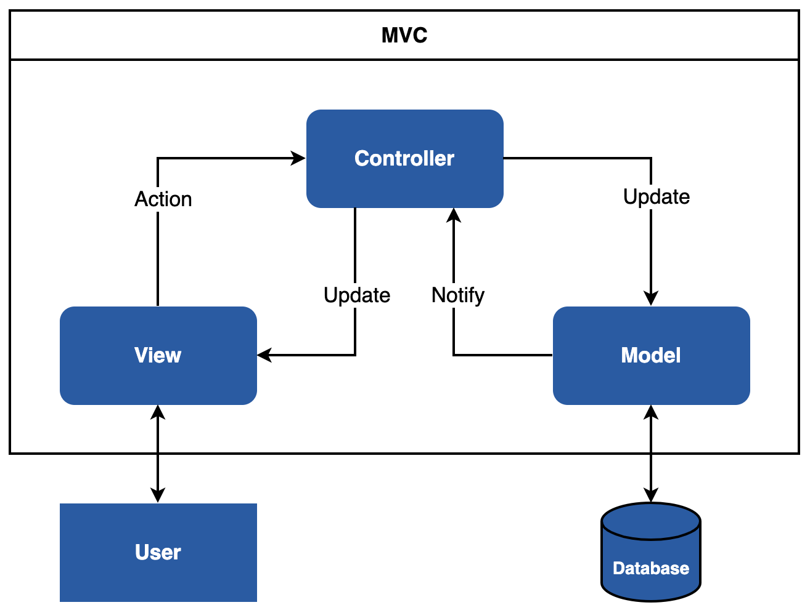

# Tutorial to Building Enterprise-Level Plotly Dash Apps


Many clients want interactive dashboards. Dashboards are a proven approach to explaining results in an understandable and comprehensible way. But creating an interactive dashboard is not a trivial task. In our view, Plotly Dash is the best choice for creating impressive diagrams. For a production-ready dashboard application, you must consider further aspects (e.g. deployment with Docker). In this tutorial, we want to share our best practices for building a well structured dashboard application with Plotly Dash. In addition, we show how to deploy a Dash App cleanly with Docker. 

## Why Plotly Dash?
[Plotly Dash](https://dash.plotly.com/) is a productive Python Framework for building web-based applications. The Open Source library is licensed under the permissive MIT license. It is written on top of Flask, Plotly.js and React.js. You can create and deploy web apps with customized user interface (UI) in Python, R or Julia. The framework abstracts the protocols and technologies needed to create a full-stack web app.

### Advantages
* You can implement the web interface in pure Python. No JavaScript is required!
* Dash is reactive! You can implement complex UIs with multiple Inputs, multiple Outputs and Inputs that depend on other Inputs.
* Dash Apps are multi-user apps. Multiple users can view a Dash App with independent sessions.
* Dash is written on top of React.js. You can implement and use your own Dash components with React.
* Dash Apps uses Flask as the backend, so you can run them using Gunicorn. Gunicorn allows you to scale a Dash App to thousands of users by increasing the number of worker processes.
* Open Source Framework (licensed under the permissive MIT license).
* Awesome documentation and community ([Dash Community Forum](https://community.plotly.com/)).

### Disadvantages
* Callbacks must have Inputs and Outputs.

Each framework has disadvantages, but the disadvantages of Dash can be solved with workarounds. The advantages outweigh the disadvantages!

## Why Docker?
You can use [Docker](https://www.docker.com/) to isolate applications. It uses a concept called container virtualization. Applications can be easily deployed with Docker because lightweight containers contain all the necessary packages. Containers share the services of a single operating system kernel, so they use fewer resources than virtual machines.

Docker makes it easy to deploy a Dash App. With Docker, you can deploy the Dash App to all architectures (amd64, i386, arm64, arm). This approach makes you independent of the deployment environment (on-premise or cloud).

## Model View Controller Pattern
The Plotly Dash template uses the Model View Controller pattern (MVC). MVC is a pattern for dividing software into the three components: Model, View and Controller.



The model component contains the business logic. This component communicates with a database or other backend components. The view component displays the data. It should be noted that the view has no direct connection to the model. The controller forms the connection. The controller is responsible for data processing. The controller updates the view with data from one or more models.

### Advantages
* Parallel development: The individual components can be implemented by different developers.
* Scalability: Multiple views for the same data model
* Avoid complexity: Division of the application into separate MVC units
* Clean separation of the concepts: Logical grouping of the specific tasks

### Disadvantages
* Strong dependency between model and controller

## Best Practices: Project Structure for Dash Apps
We show you our best practices with an example Dash app. Feel free to use this template as the basis for your next Dash App.

We recommend working in a virtual environment (e.g. [conda](https://docs.conda.io/en/latest/)). Please install conda on your system. Create a virtual environment to keep your main system clean.

Create and activate the conda environment:

```bash
$ conda create -n dash-app python=3.9.12
$ conda activate dash-app
```

Web apps consist of many components and pages. We recommend that you divide the individual concepts into several folders and files. This approach simplifies the maintenance of the web app considerably.

We recommend the following structure:
<pre>
.
├── dash-app              
│   └── assets              # this folder contains style files
│   │   ├── style.py
│   │   └── typography.css
│   ├── components          # this folder contains reusable components
│   │   ├── dropdown.py
│   │   └── navbar.py
│   ├── environment         # this folder contains environment settings
│   │   ├── .env
│   │   ├── .env_development
│   │   └── settings.py
│   ├── pages               # this folder contains the pages
│   ├── plots               # this folder contains different plots
│   ├── utils               # this folder contains helper functions
│   ├── app.py
│   ├── Dockerfile
│   ├── index.py
│   └── requirements.txt
</pre>

We go through the individual folders and files in detail from top to bottom.

### assets folder
This folder contains the style information (e.g. CSS, JavaScript files or favicon.ico) of your Dash App. Dash automatically serves all files when you name the folder assets.

#### style.py 
```Python
# main style of the app
MAIN_COLORS = {
    'primary': '#165AA7',
    'secondary': '#000000',
    'third': '#FFFFFF',
}
```

In the style.py file, we define the color scheme of the app. A Python dictionary is a good choice. We can easily access the dictionary information from other files. For more style information, you can easily create another dictionary.

#### typography.css
```css
body {
    font-family: sans-serif;
}

h1, h2, h3, h4, h5, h6 {
    text-align: center;
}
```

The typography.css file contains the typography information.

### components folder
This folder contains all reusable components (e.g. dropdown, button or table). The advantage is that you can use these components on several pages.

#### dropdown.py
```Python
from dash import dcc

def render_dropdown(dropdown_id: str, items=[''], clearable_option=False):
    dropdown = dcc.Dropdown(
        id=dropdown_id,
        clearable=clearable_option,
        options=[{'label': i, 'value': i} for i in items],
        value=items[0],
    )
    return dropdown
```

For the dropdown menu, we use the [Dash Core Components](https://dash.plotly.com/dash-core-components/dropdown). We can use the function render_dropdown() whenever we need a dropdown menu. The advantage is that all dropdown menus have the same style.

#### navbar.py
```Python
import dash_bootstrap_components as dbc

from environment.settings import VERSION

# import own style (see /assets)
from assets.style import MAIN_COLORS

navbar = dbc.NavbarSimple(
    children=[
        dbc.NavItem(dbc.NavLink("Dashboard", href="/dashboard")),
    ],
    brand="Gapminder " + VERSION,
    brand_href="/",
    color=MAIN_COLORS["primary"],
    sticky='top',
    links_left=True,
    dark=True
)
```

The navigation bar contains the links to the individual pages. For the navigation bar, we use the [Dash Bootstrap Components](https://dash-bootstrap-components.opensource.faculty.ai/docs/components/navbar/). You can design the dbc.NavbarSimple() component individually.

### environment folder
Different environments have different configuration files. There are Dev, Staging, Prod, and others. This folder contains the different environment files. In our case, we have a development (.env_development) and a production (.env) environment.

#### .env
```
VERSION=1.0.0
```

This file contains the production parameters. We use the VERSION parameter later in the web interface to see which environment is active.

#### .env_development
```
VERSION=1.0.0-dev
HOST=127.0.0.1
PORT=7000
DEBUG=True
```

This file contains the development parameters. The parameters HOST, PORT, and DEBUG will use for the local development server.

#### settings.py
```Python
import os
from dotenv import load_dotenv

env_path = os.path.join(os.path.dirname(__file__), os.getenv('ENV_FILE') or ".env_development")
load_dotenv(dotenv_path=env_path, override=True)

VERSION = os.environ.get("VERSION")

APP_HOST = os.environ.get("HOST")
APP_PORT = os.environ.get("PORT")
APP_DEBUG = bool(os.environ.get("DEBUG"))
```

In this file, we read the environment configurations. For this, we use the Python package python-dotenv. First, we read the correct configuration file based on the environment variable ENV_FILE. For local development, we use .env_development. Via the ENV_FILE environment variable, we can define the corresponding environment. We set the ENV_FILE variable later in the Dockerfile. In our case, .env is the production environment.

### pages folder
A web app usually consists of several pages. We recommend creating a folder for each page. Each page folder contains three files to apply the MVC pattern. A page has a model, view and controller file. So we have a clean separation of concepts.

#### dashboard/dashboard_controller.py
```Python
from dash.dependencies import Input, Output
from app import app
from pages.dashboard.dashboard_model import map_dataframe

# import components
from plots.map_plot import *


@app.callback(
    Output(component_id='div-vis', component_property='children'),
    Input(component_id='dropdown-choose-item', component_property='value')
)
def update_vis(variable):
    df = map_dataframe()
    fig = bubble_map(df, variable)

    return fig
```

The controller is the interface between the view and the model. The controller reacts to the events of the web interface. In addition, the controller obtains the data from the model. Finally, the controller returns the results to the web interface.

#### dashboard/dashboard_model.py
```Python
import plotly.express as px

def get_map_data():
     df = px.data.gapminder()
     return df

def map_dataframe():
    return get_map_data()
```

In the dashboard_model.py file, we get the data via the built-in dataset gapminder of the package plotly.express.data.

#### dashboard/dashboard_view.py
```Python
import dash_bootstrap_components as dbc
from dash import html

# import components
from components.dropdown import render_dropdown
from components.navbar import navbar


def render_dashboard():
    return html.Div([
        navbar,
        html.Div(
            [
                html.Br(),
                dbc.Container(
                    fluid=True,
                    children=[
                        dbc.Row(
                            [
                                dbc.Col(
                                    width=2,
                                    children=dbc.Card(
                                        [
                                            dbc.CardHeader("Variables"),
                                            dbc.CardBody(
                                                [
                                                    render_dropdown(dropdown_id="dropdown-choose-item", items=['Population', 'Life expectancy', 'GDP per capita'])
                                                ]
                                            )
                                        ],
                                        style={'height': "84vh"},
                                    )
                                ),
                                dbc.Col(
                                    width=10,
                                    children=dbc.Card(
                                        [
                                            dbc.CardHeader("World map"),
                                            dbc.CardBody(
                                                [
                                                    html.Div(id='div-vis')
                                                ]
                                            )
                                        ],
                                        style={'height': '84vh'}
                                    )
                                )
                            ]
                        )
                    ]
                ),
            ]
        )
    ])
```

In this file, we define the appearance of the web interface. In this context, we use the dropdown menu and the navbar from the components folder.

#### page_not_found.py
```Python
from dash import html

def page_not_found():
    return html.Div([
        html.H1('404'),
        html.H2('Page not found'),
        html.H2('Oh, something went wrong!')
    ])
```

This page appears when a page is not found. For example, if you enter an incorrect path in the URL.

### plots folder
This folder contains the different plots of the app. We recommend creating a new file for each plot type.

#### map_plot.py
```Python
from dash import dcc
import plotly.express as px


def bubble_map(df, variable):
    dict_variable = {'Population':'pop', 'Life expectancy':'lifeExp', 'GDP per capita':'gdpPercap'}
    variable = dict_variable[variable]

    fig = px.scatter_geo(df, locations="iso_alpha", color="continent",
                     hover_name="country", size=variable,
                     animation_frame="year",
                     projection="natural earth")
    
    return dcc.Graph(figure=fig)
```

We use [Plotly Express](https://plotly.com/python/plotly-express/) for the map chart. An awesome library. Check it out!

### utils folder
This folder contains helper functions and components that can be used in general. An example is a connector to other services (e.g. RESTful Services).

### app.py
```Python
import dash
import dash_bootstrap_components as dbc

APP_TITLE = "Plotly Dash"
app = dash.Dash(__name__,
                title=APP_TITLE,
                update_title='Loading...',
                suppress_callback_exceptions=True,
                external_stylesheets=[dbc.themes.FLATLY])
```

In this file, we create the Dash instance with dash.Dash(). We have a dynamic layout which is why we set suppress_callback_exceptions to True. In addition, we use the FLATLY theme from the [Dash Bootstrap Components themes](https://dash-bootstrap-components.opensource.faculty.ai/docs/themes/explorer/).

### index.py
```Python
from dash import dcc
from dash import html
from dash.dependencies import Input, Output

# import pages
from pages.dashboard.dashboard_view import render_dashboard
from pages.dashboard.dashboard_controller import *
from pages.page_not_found import page_not_found

from app import app

from environment.settings import APP_HOST, APP_PORT, APP_DEBUG

server = app.server

def serve_content():
    return html.Div([
        dcc.Location(id='url', refresh=False),
        html.Div(id='page-content')
    ])

app.layout = serve_content()

@app.callback(Output('page-content', 'children'),
              Input('url', 'pathname'))
def display_page(pathname):
    if pathname in '/' or pathname in '/dashboard':
        return render_dashboard()
    return page_not_found()

if __name__ == '__main__':
    app.run_server(debug=APP_DEBUG, host=APP_HOST, port=APP_PORT)
```

This file is the entry point of the Dash App. For Gunicorn, it is important to define server = app.server. That sets the Flask server for the app. The function display_page() will be triggered when the page changes. For the development environment, we pass app.run_server() the parameters from the dev environment file.

### requirements.txt
```
dash==2.9.2
dash-bootstrap-components==1.4.1
gunicorn==20.1.0
python-dotenv==1.0.0
geopandas==0.13.0
```

This file contains all required dependencies. Please install the dependencies with the following command:
```bash
pip install -r requirements.txt
```

Now we are ready to start the app.

## Local Development
Navigate to the dash-app folder and execute the following command:
```bash
python index.py
```

The Dash App starts. You can open the app at http://127.0.0.1:7000. We can see the version number 1.0.0-dev that we set in the development environment. Dash provides debug information in the bottom right corner. The [Dash Dev Tools](https://dash.plotly.com/devtools) are enabled when developing your Dash App.

## Deployment with Docker
Note: Please install [Docker](https://www.docker.com/get-started/) on your system.

### Dockerfile
In the Dockerfile, we create a user and a virtual environment. A virtual environment helps to keep control over the Python dependencies. It also keeps the difference between the local development environment and the container application small. The tutorial “[Elegantly activating a virtualenv in a Dockerfile](https://pythonspeed.com/articles/activate-virtualenv-dockerfile/)” by Itamar Turner-Trauring describes how to activate a virtual environment in a Dockerfile. Read it if you are interested! The virtual environment does not slow down the Dash application. Also, we are less likely to encounter strange bugs over time (e.g. changes at the operating system level). In the last line, we define the entry point. The host must be 0.0.0.0 so that the Dash App is accessible.

Now you can build the app with the following command:
```bash
docker build -t dash-app:latest .
```

Run the app with the following command:
```bash
docker run --name dashboard -d -p 7000:7000 dash-app
```

Now you can open the app at http://0.0.0.0:7000.

We can see the version number 1.0.0 that we set in the production environment file. Docker allows us to deploy the Dash application in a lightweight container independent of the environment in the cloud or on-premises.

That's all. Enjoy! 

## Follow us for more content
* [X](https://x.com/tinztwins)
* [Tinz Twins Hub](https://tinztwinshub.com)